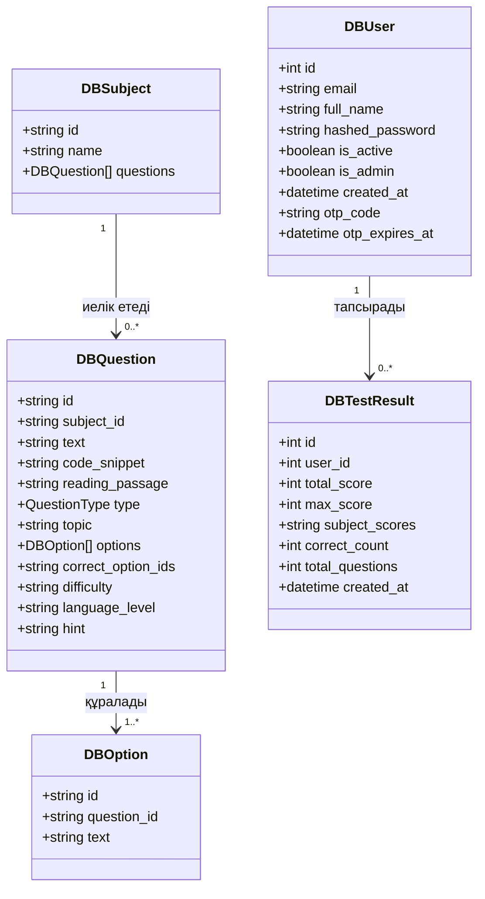

# 🎓 Magistracy Prep AI (MagisCore) — Жүйенің техникалық архитектурасы мен сипаттамасы

Бұл құжат **Magistracy Prep AI (MagisCore)** платформасының мақсатын, акторларын, функцияларын, архитектурасын және техникалық сипаттамасын толық қамтиды. Ол дипломдық жұмысқа, техникалық есептерге немесе жоба құжаттамасына пайдалануға арналған.

---

## 1. Жүйенің мақсаты (System Purpose)

**Magistracy Prep AI (MagisCore)** жүйесінің негізгі мақсаты — магистратураға түсуші үміткерлерді Комплексті Тестілеуге (КТ) сапалы, тиімді және психологиялық тұрғыдан дайындайтын интеллектуалды, интерактивті білім беру платформасын ұсыну.

**Жүйенің негізгі міндеттері:**
*   **Реалистік симуляция:** Қазақстан Республикасының КТ стандартына сәйкес келетін 130 сұрақтық толық форматтағы тестілеуді (Ағылшын тілі, Оқуға дайындық деңгейі (ОДАТ), Алгоритмдер, Дерекқорлар) 235 минуттық уақытпен шектей отырып симуляциялау.
*   **Интеллектуалды аудио генерация (AI Listening):** Ағылшын тілінің тыңдалым бөліміне арналған шынайы өмірден алынған табиғи диалогтар мен монологтарды заманауи Generative AI (TTS) көмегімен дыбыстау.
*   **Қауіпсіздік пен әділдікті бақылау (Proctoring):** Үміткердің тест барысында браузер терезесінен басқа бетке ауысуын (Tab switching / Window unfocus) тіркеу арқылы әділ емтихан ортасын қалыптастыру.
*   **Жеке оқу бағыты мен статистика:** Үміткердің тест нәтижелерін пәндер бойынша егжей-тегжейлі талдап, оның әлсіз тұстарын көрсету және қатемен жұмыс істеуге мүмкіндік беру.

---

## 2. Қолданушылар мен акторлар (Users & Actors)

Жүйеде екі негізгі актор қарастырылған:

1.  **Үміткер (Student / User):**
    *   Платформаға тіркеледі, логин мен пароль арқылы кіреді.
    *   Парольді ұмытқан жағдайда электронды пошта арқылы OTP (One-Time Password) арқылы қауіпсіз қалпына келтіреді.
    *   Пәндердің оқу бағдарламасымен (Syllabus) және теориялық материалдарымен танысады.
    *   КТ форматындағы тестілеуді бастап, тапсырады (аудио ойнатады, код фрагменттерін талдайды, кеңестер алады).
    *   Тест нәтижесін, қателерін және өз тест тапсыру тарихын бақылайды.
2.  **Администратор (Admin):**
    *   Жүйенің жалпы статистикасын бақылайды (жалпы қолданушылар, тесттер саны, орташа балл).
    *   Барлық тіркелген қолданушылардың тізімін және олардың белсенділігін көреді.
    *   Әр қолданушының тест тапсыру тарихы мен әрбір талпынысының егжей-тегжейлі нәтижелерін бақылайды.

---

## 3. Негізгі функциялар (Main Functions)

*   **Қауіпсіз авторизация жүйесі (Authentication):**
    *   JWT (JSON Web Tokens) негізіндегі сессияны басқару.
    *   Парольдерді PBKDF2-SHA256 алгоритмімен хэштеп сақтау.
    *   SMTP арқылы электронды поштаға 6 таңбалы OTP код жіберу арқылы парольді қауіпсіз қалпына келтіру.
*   **Тестілеу құрастыру модулі (Smart Test Generator):**
    *   КТ форматына сәйкес келесі сұрақтарды кездейсоқ таңдап құрастыру:
        *   **Ағылшын тілі:** 50 сұрақ (16 тыңдалым [2 аудио × 8 сұрақ], 18 грамматика/лексика, 16 оқылым [2 мәтін × 8 сұрақ]).
        *   **Оқуға дайындық (ОДАТ):** 30 логикалық/аналитикалық сұрақ.
        *   **Алгоритмдер және деректер құрылымы:** 30 кәсіби сұрақ (код фрагменттерімен).
        *   **Дерекқорлар:** 20 кәсіби сұрақ.
*   **Интерактивті тест тапсыру интерфейсі (Interactive Test Interface):**
    *   235 минуттық жаһандық таймер және секундтық бақылау.
    *   Аудио-тыңдалым сұрақтарында дыбыс ойнатқышты интеграциялау.
    *   Код фрагменттерін әдемі және оқылымды форматта көрсету.
    *   Бір дұрыс жауабы бар (Single Choice - 1 балл) және бірнеше дұрыс жауабы бар (Multiple Choice - 2 балл) сұрақтарды өңдеу.
    *   Қиналған сұрақтар үшін кеңес (Hint) жүйесі.
*   **Прокторинг / Қауіпсіздік мониторингі:**
    *   Браузер фокусын жоғалтқан сәттерді (window blur / tab switch) анықтап, есептегішке жазу.
    *   Тест соңында үміткерге қанша рет ереже бұзғанын ескерту ретінде көрсету.
*   **Нәтижелерді есептеу және сақтау (Evaluation Engine):**
    *   Пәндер бойынша және жалпы балды бірден есептеу.
    *   Нәтижелерді JSON форматында дерекқорға жазып, статистика жинау.
*   **Адмін басқару панелі (Admin Dashboard):**
    *   Жалпы жүйе көрсеткіштерінің аналитикасы.
    *   Пайдаланушылардың орташа және максималды балдарын бақылау.

---

## 4. Жүйенің технологиялық архитектурасы (Technological Architecture)

Жүйе заманауи **Client-Server (клиент-серверлік)** архитектурасы бойынша құрылған. Клиенттік және серверлік бөліктер бір-бірінен толық тәуелсіз жұмыс істейді және өзара REST API арқылы байланысады.

```mermaid
graph TD
    subgraph Frontend (React + TypeScript)
        UI[React Components / Welcome, Test, Admin]
        AS[Auth & API Service / axios]
    end
    
    subgraph Backend (FastAPI)
        API[FastAPI Router / main.py]
        Auth[Auth Module / auth.py]
        DB_ORM[SQLAlchemy ORM]
    end
    
    subgraph Database
        DB[(PostgreSQL / SQLite)]
    end
    
    subgraph AI/ML Module
        TTS[Qwen3-TTS / Text-to-Speech]
    end

    UI -->|Пароль/Сұраныстар| AS
    AS -->|HTTP REST Requests (JWT)| API
    API --> Auth
    API --> DB_ORM
    DB_ORM --> DB
    TTS -.->|Аудио диалогтарды генерациялау| DB
```

---

## 5. Data Flow (Деректер қозғалысы) диаграммасына арналған процестер

Data Flow диаграммасында (DFD) деректердің қозғалысын сипаттайтын 6 негізгі процесс бар:

1.  **P1: Тіркелу және Авторизация (User Registration & Auth):**
    *   *Кіріс:* Пайдаланушы енгізген email, аты-жөні, паролі.
    *   *Процесс:* Парольді хэштеу, дерекқордағы деректермен салыстыру, JWT токенін генерациялау.
    *   *Шығыс:* Авторизация токені (JWT) және пайдаланушы профилінің деректері.
2.  **P2: OTP арқылы парольді қалпына келтіру (OTP Password Reset):**
    *   *Кіріс:* Пайдаланушының электронды поштасы.
    *   *Процесс:* 6 таңбалы OTP код генерациялау, SMTP арқылы хат жіберу, кодты растап парольді жаңарту.
    *   *Шығыс:* Жаңартылған хэш-пароль және сәтті өзгертілгені туралы хабарлама.
3.  **P3: Тест сұрақтарын генерациялау (Smart Test Generation):**
    *   *Кіріс:* Тест бастау сұранысы (Пән ID-лері, сұрақтар саны).
    *   *Процесс:* Дерекқордан сұрақтарды таңдау, ағылшын тілі үшін тыңдалым аудиоларын және оқу мәтіндерін сұрақтарымен бірге топтастыру, сұрақтар мен нұсқаларды рандомизациялау.
    *   *Шығыс:* 130 сұрақтан тұратын тест құрылымы (JSON).
4.  **P4: Тест тапсыру және Прокторинг бақылауы (Test Taking & Proctoring):**
    *   *Кіріс:* Үміткердің жауаптары, браузер фокусын жоғалту оқиғалары.
    *   *Процесс:* Уақытты есептеу, ереже бұзушылықты тіркеу, жауаптарды уақытша күйде сақтау.
    *   *Шығыс:* Аяқталған тест бойынша жауаптар тізімі және ескертулер саны.
5.  **P5: Балдарды есептеу және сақтау (Evaluation & Storage):**
    *   *Кіріс:* Аяқталған тест жауаптары.
    *   *Процесс:* Сұрақ түрлеріне сәйкес (Single/Multiple) балдарды есептеу, пәндер бойынша статистиканы дайындау, дерекқорға нәтижені жазу.
    *   *Шығыс:* Есептелген тест нәтижесі (Балл, дұрыс жауап саны, уақыты).
6.  **P6: Статистика мен Тарихты басқару (History & Stats Engine):**
    *   *Кіріс:* Пайдаланушы немесе Администратор сұранысы.
    *   *Процесс:* Дерекқордан тест нәтижелерін, қолданушылар тізімін сұрыптап алу.
    *   *Шығыс:* Графиктер мен кестелерге арналған статистикалық деректер.

---

## 6. UML диаграммасына арналған негізгі модульдер мен кластар

Жүйенің деректер құрылымы мен ORM модельдері келесі негізгі кластардан тұрады:



*   **`DBUser`:** Қолданушы профилі және OTP пароль қалпына келтіру күйін сақтайды.
*   **`DBSubject`:** Дайындық пәндерін сипаттайды.
*   **`DBQuestion`:** Сұрақтардың толық сипаттамасы (мәтіні, қиындық деңгейі, код фрагменттері, оқу мәтіні, аудио сілтемесі және кеңесі).
*   **`DBOption`:** Сұрақтарға сәйкес келетін жауап нұсқалары.
*   **`DBTestResult`:** Әр талпынысының нәтижелерін, жинаған балдарын және пәндер бойынша статистикасын сақтайды.

---

## 7. Use Case диаграммасына арналған акторлар мен use case тізімі

```mermaid
gesture
left to right direction
actor Student as "Үміткер (Student)"
actor Admin as "Администратор (Admin)"

rectangle "Magistracy Prep AI System" {
    usecase UC_Auth as "Тіркелу және жүйеге кіру"
    usecase UC_OTP as "Парольді OTP арқылы қалпына келтіру"
    usecase UC_Syllabus as "Силабусты/оқу бағдарламасын қарау"
    usecase UC_Test as "КТ сынақ тестін тапсыру"
    usecase UC_Audio as "Аудио тыңдалым ойнату"
    usecase UC_Hint as "Көмекші кеңесті (Hint) көру"
    usecase UC_History as "Өз тест тапсыру тарихын қарау"
    
    usecase UC_Stats as "Жүйенің жалпы статистикасын бақылау"
    usecase UC_Users as "Пайдаланушылар тізімін қарау"
    usecase UC_Details as "Үміткерлердің тест нәтижелерін бақылау"
}

Student --> UC_Auth
Student --> UC_OTP
Student --> UC_Syllabus
Student --> UC_Test
UC_Test ..> UC_Audio : <<include>>
UC_Test ..> UC_Hint : <<extend>>
Student --> UC_History

Admin --> UC_Stats
Admin --> UC_Users
Admin --> UC_Details
```

---

## 8. Қолданылған технологиялар (Tech Stack)

### Frontend (Клиенттік бөлік)
*   **React (v18):** Компоненттік негіздегі интерактивті пайдаланушы интерфейсін құруға арналған кітапхана.
*   **TypeScript:** Қателіктерді ерте анықтау үшін типтелген бағдарламалау тілі.
*   **Vite:** Жобаны жылдам жинақтаушы және дамытушы құрал (bundler).
*   **React Router DOM:** Бағдарламаның беттері арасында жылдам өтуді қамтамасыз ететін маршрутизатор (routing).
*   **Vanilla CSS (Glassmorphism):** Жүйеге заманауи, жартылай мөлдір, анимецияланған және премиум дизайн беру үшін қолданылды.

### Backend (Серверлік бөлік)
*   **FastAPI (Python):** Өнімділігі өте жоғары, асинхронды (asyncio) сұраныстарды қолдайтын заманауи REST API фреймворкі.
*   **SQLAlchemy ORM:** Python кластарын дерекқор кестелерімен байланыстыратын қуатты ORM технологиясы.
*   **Pydantic (v2):** Серверге келетін және кететін деректерді жылдам валидациялау құралы.
*   **python-jose / PyJWT:** Қауіпсіз JWT (JSON Web Tokens) авторизациялық токендерін генерациялау және оқу.
*   **Uvicorn:** Асинхронды сұраныстарды өңдейтін жылдам ASGI сервері.

### Дерекқор (Database)
*   **SQLite:** Әзірлеу және жергілікті сынақ кезеңінде жылдам, файлға негізделген жеңіл дерекқор.
*   **PostgreSQL / SQLAlchemy:** Өндірістік ортаға (Railway сияқты бұлттық платформаларға) арналған сенімді, реляциялық дерекқор жүйесі.

### API
*   **RESTful API:** Стандартталған JSON форматындағы деректермен жұмыс істейтін, JWT Bearer авторизациясымен қорғалған бағдарламалық интерфейс.

### AI/ML бөлігі (Генеративті АИ)
*   **Qwen3-TTS Model (`Qwen/Qwen3-TTS-12Hz-1.7B-CustomVoice`):** Ағылшын тілінен шынайы және табиғи диалогтарды дыбыстауға арналған 1.7 миллиард параметрлі заманауи генеративті AI (Text-To-Speech) моделі.
*   **PyTorch (CUDA):** Нейрондық желіні серверде немесе бейнекартада (GPU) жылдам орындауға арналған фреймворк.
*   **SoundFile / Librosa:** Синтезделген аудио сигналдарды өңдеу және `.wav` форматында сақтау кітапханалары.
